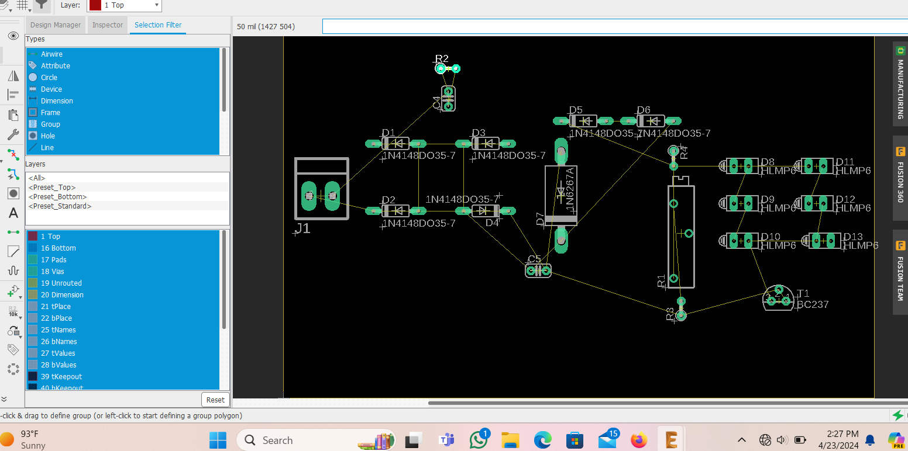

# PCB-Design--Automatic-night-lamp

# Aim
To design a PCB circuit for automatic night lamp using eagle sofware.

# Software required
Eagle 

# Procedure

Open EAGLE and create a new project for your PCB design.  
Open a new schematic file within your project. 
Use the libraries provided in EAGLE or create custom libraries if necessary. 
Place components onto the schematic sheet by using the 'Add' tool. 
Connect the components using the 'Net' tool. 
Label nets appropriately to ensure clarity 
Once routing is complete, perform a ERC to ensure there are no errors and save the schematic. 
Click on the 'Generate/Switch to Board' icon to create a board from your schematic. 
EAGLE's board layout editor allows you to place components, route traces, and define board shapes. 
Arrange components on the board to optimize space usage and minimize signal interference. 
Route traces to connect components according to your schematic. 
Use the various routing and editing tools provided by EAGLE to ensure proper routing and avoid design rule violations. 
Once routing is complete, perform a design rule check (DRC) to ensure there are no errors and save the board layout. 
Go to File > CAM Processor and set up CAM jobs to generate Gerber files for your PCB layers. 
Verify generated files to ensure they contain all necessary information. 
Save the generated manufacturing files 

# Theory

Here is a simple dark sensor circuit that is useful to switch ON and OFF any appliances automatically depending on the Light. As an output device, we’ll utilise an LED in this example. To detect the light, we will use an LDR (Light-dependent Resistor). As the name says, when the light intensity on LDR is high, the resistance through it decreases; when the light intensity on LDR is low, the resistance through it increases and becomes extremely high. It’s a kind of variable resistor, but the resistance varies based on the light.

### Working 
During the daytime when there is a light, the LDR has very low resistance and all voltage coming through R1 dropped with the ground. This makes the voltage at the base of the transistor very low and it will not switch ON the transistor. Because the transistor is OFF, the current will not flow through the transistor. As a result, LED will not turn ON.At night when there is no light, the LDR has high resistance and very less power dropped with the ground. This makes the voltage at the base of the transistor high to turn the transistor ON. Because the transistor is turned ON, current flows through the transistor. It flows from the positive battery terminal, through R2, the LED, and the transistor down to the negative battery terminal. As a result, the LED turns ON.The same circuit can be used for a variety of purposes. Check out the Automatic Street Light Control System using LDR application. Instead of LED, bulbs are used using a relay.

# Circuit Diagram

# Output

### Schematic diagram

### Layout diagram

# Result
Thus the automatic night lamp circuit was designed using proteus software.

